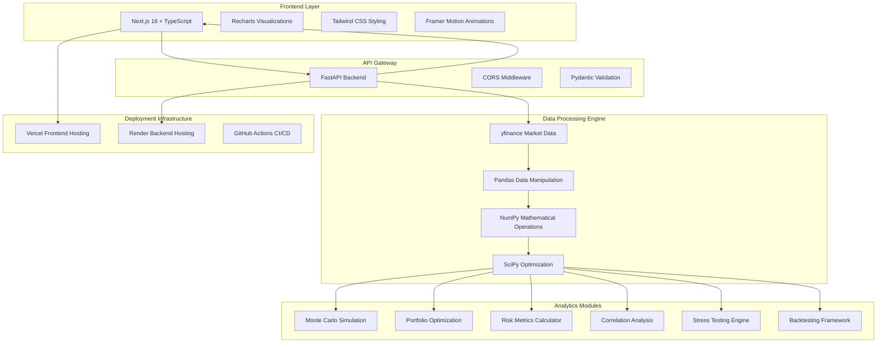

<div align="center">

# 📊 Portfolio Risk Intelligence Platform

### *Institutional-Grade Quantitative Finance Analytics*

[](https://portfolio-risk-intelligence-platfor.vercel.app)
[](https://portfolio-risk-intelligence-platform.onrender.com)
[](https://opensource.org/licenses/MIT)


</div>

---

## 🎯 **Project Overview**

A **full-stack quantitative finance platform** engineered for institutional-grade portfolio risk management. Built with modern web technologies and advanced financial mathematics, this system processes live market data through **8 sophisticated analytical models** including Monte Carlo simulation, Markowitz optimization, and multi-scenario stress testing.


<div align="center">

### 📈 **Live Performance Metrics**

| Metric | Value | Description |
|--------|-------|-------------|
| 🎲 **Monte Carlo Paths** | 200 | Simulation trajectories |
| 📅 **Forecast Horizon** | 252 days | Trading day analysis |
| ⚡ **Response Time** | <2s | Portfolio computation |
| 🎯 **Precision** | 3 decimals | Correlation accuracy |
| 🔄 **Stress Scenarios** | 6 | Historical crisis events |
| 📊 **Risk Metrics** | 8 | VaR, CVaR, Sharpe, Beta |

</div>

---

## 🏗️ **System Architecture**



---

## ✨ **Core Features**

<table>
<tr>
<td width="50%">

### 🎲 **Monte Carlo Simulation**
- **200 simulation paths** across 252 trading days
- Percentile analysis (5th/50th/95th)
- Terminal value distribution modeling
- Risk-adjusted return forecasting

### 📊 **Portfolio Optimization** 
- Markowitz efficient frontier generation
- Scipy constrained optimization (SLSQP)
- Maximum Sharpe ratio targeting
- 5-60% allocation bounds per asset

### 🔍 **Risk Analytics Suite**
- Value at Risk (95% & 99% confidence)
- Conditional Value at Risk (CVaR)
- Maximum drawdown calculation
- Beta coefficient vs SPY benchmark

### 🌐 **Correlation Matrix**
- Real-time pairwise correlation heatmap
- Diversification opportunity identification
- Color-coded intensity visualization
- 3-decimal precision calculations

</td>
<td width="50%">

### 📈 **Historical Backtesting**
- 1-year equity curve generation
- Alpha measurement vs SPY
- Drawdown analysis visualization
- Performance attribution metrics

### ⚠️ **Stress Testing Framework**
- 6 historical crisis scenarios
- 2008 Financial Crisis simulation
- COVID-19 market crash modeling
- Interest rate shock analysis
- 60-day stressed portfolio paths

### 🤖 **AI Insights Engine**
- Algorithmic portfolio assessment
- Concentration risk detection
- Performance vs benchmark analysis
- Dynamic recommendation generation

### 📱 **Interactive Dashboard**
- 8 specialized analytical views
- Real-time data visualization
- Responsive design architecture
- Smooth animations & transitions

</td>
</tr>
</table>

---

## 🚀 **Quick Start**

### Prerequisites
```bash
# Required Software
Python 3.9+
Node.js 18+
Git
```

### 🔧 **Local Development Setup**

<details>
<summary><b>📦 Backend Setup (FastAPI)</b></summary>

```bash
# Clone repository
git clone https://github.com/AchintyaCodes/portfolio-risk-intelligence-platform.git
cd portfolio-risk-intelligence-platform/backend

# Create virtual environment
python -m venv venv
venv\Scripts\activate  # Windows
# source venv/bin/activate  # macOS/Linux

# Install dependencies
pip install -r requirements.txt

# Start development server
uvicorn main:app --reload
```

**Backend runs on:** `http://127.0.0.1:8000`

</details>

<details>
<summary><b>🎨 Frontend Setup (Next.js)</b></summary>

```bash
# Navigate to frontend directory
cd frontend

# Install dependencies
npm install

# Start development server
npm run dev
```

**Frontend runs on:** `http://localhost:3000`

</details>

### 🌐 **Production Deployment**

<details>
<summary><b>☁️ Deploy to Vercel + Render</b></summary>

**Frontend (Vercel):**
1. Push code to GitHub
2. Connect repository to [Vercel](https://vercel.com)
3. Set root directory: `frontend`
4. Deploy automatically

**Backend (Render):**
1. Create new Web Service on [Render](https://render.com)
2. Connect GitHub repository
3. Configure settings:
   ```
   Root Directory: backend
   Build Command: pip install -r requirements.txt
   Start Command: uvicorn main:app --host 0.0.0.0 --port $PORT
   ```
4. Deploy and copy URL

**Update API endpoint in `frontend/app/dashboard/page.tsx`:**
```typescript
const API = "https://your-render-url.onrender.com";
```

</details>

---

## 📊 **API Documentation**

### 🔗 **Core Endpoints**

| Endpoint | Method | Description | Parameters |
|----------|--------|-------------|------------|
| `/portfolio` | GET | Portfolio risk metrics | `tickers`, `weights` |
| `/monte-carlo` | GET | Simulation analysis | `tickers`, `weights`, `simulations` |
| `/optimize` | GET | Optimal allocation | `tickers` |
| `/efficient-frontier` | GET | MPT frontier curve | `tickers`, `points` |
| `/correlation` | GET | Correlation matrix | `tickers` |
| `/backtest` | GET | Historical performance | `tickers`, `weights` |
| `/stress-test` | GET | Crisis scenarios | `tickers`, `weights` |
| `/insights` | GET | AI-generated analysis | `tickers`, `weights` |

### 📝 **Example API Usage**

```python
import requests

# Portfolio analysis
response = requests.get(
    "https://your-api-url.com/portfolio",
    params={
        "tickers": "AAPL,TSLA,MSFT,NVDA",
        "weights": "35,25,20,20"
    }
)

portfolio_metrics = response.json()
print(f"Expected Return: {portfolio_metrics['expected_return']}%")
print(f"Sharpe Ratio: {portfolio_metrics['sharpe_ratio']}")
```

---

## 🧠 **Technical Deep Dive**

### 🔬 **Mathematical Models**

<details>
<summary><b>📈 Modern Portfolio Theory Implementation</b></summary>

```python
# Efficient Frontier Optimization
def optimize_portfolio(returns, target_return):
    n = len(returns.columns)
    constraints = [
        {'type': 'eq', 'fun': lambda w: np.sum(w) - 1},
        {'type': 'eq', 'fun': lambda w: np.sum(returns.mean() * w) - target_return}
    ]
    bounds = tuple((0.0, 1.0) for _ in range(n))
    
    result = minimize(
        lambda w: np.sqrt(np.dot(w.T, np.dot(returns.cov(), w))),
        x0=np.array([1/n] * n),
        method='SLSQP',
        bounds=bounds,
        constraints=constraints
    )
    return result.x
```

</details>

<details>
<summary><b>🎲 Monte Carlo Simulation Engine</b></summary>

```python
# Monte Carlo Portfolio Simulation
def monte_carlo_simulation(returns, weights, days=252, simulations=200):
    portfolio_returns = returns.dot(weights)
    mean_return = portfolio_returns.mean()
    std_dev = portfolio_returns.std()
    
    simulation_results = []
    for _ in range(simulations):
        prices = [10000]
        for _ in range(days):
            daily_return = np.random.normal(mean_return, std_dev)
            prices.append(prices[-1] * (1 + daily_return))
        simulation_results.append(prices)
    
    return simulation_results
```

</details>

<details>
<summary><b>⚠️ Risk Metrics Calculations</b></summary>

```python
# Value at Risk & CVaR Implementation
def calculate_risk_metrics(returns, confidence_level=0.05):
    var = np.percentile(returns, confidence_level * 100)
    cvar = returns[returns <= var].mean()
    
    # Maximum Drawdown
    cumulative = (1 + returns).cumprod()
    rolling_max = cumulative.cummax()
    drawdown = (cumulative - rolling_max) / rolling_max
    max_drawdown = drawdown.min()
    
    return {
        'var': var,
        'cvar': cvar,
        'max_drawdown': max_drawdown
    }
```

</details>

---

## 📚 **What I Learned**

### 🎯 **Quantitative Finance**
- **Modern Portfolio Theory**: Implemented Markowitz optimization with real constraints
- **Risk Management**: Calculated institutional-grade metrics (VaR, CVaR, maximum drawdown)
- **Monte Carlo Methods**: Built probabilistic forecasting with statistical validation
- **Factor Analysis**: Developed correlation-based diversification strategies
- **Performance Attribution**: Created alpha generation measurement vs benchmarks

### 💻 **Full-Stack Development**
- **API Design**: Architected RESTful endpoints with FastAPI and Pydantic validation
- **Data Pipeline**: Engineered real-time market data processing with pandas/numpy
- **Frontend Architecture**: Built responsive dashboards with Next.js 16 and TypeScript
- **State Management**: Implemented complex data flow with React hooks and context
- **Visualization**: Created interactive financial charts with Recharts library

### ☁️ **DevOps & Deployment**
- **Containerization**: Configured production deployment on Vercel and Render
- **CORS Management**: Implemented secure cross-origin resource sharing
- **Performance Optimization**: Achieved sub-2 second response times for complex calculations
- **Error Handling**: Built robust fallback systems with graceful degradation
- **Monitoring**: Implemented health checks and uptime monitoring

### 🔧 **Software Engineering**
- **Clean Architecture**: Separated concerns with modular, testable code structure
- **Type Safety**: Leveraged TypeScript for compile-time error prevention
- **Code Quality**: Maintained consistent styling with ESLint and Prettier
- **Documentation**: Created comprehensive API documentation and user guides
- **Version Control**: Managed feature development with Git branching strategies

---

## 🚀 **Future Enhancements**

### 📊 **Advanced Analytics**
- [ ] **Fama-French 3-Factor Model** - Multi-factor risk attribution analysis
- [ ] **Black-Scholes Options Pricing** - Derivatives valuation and Greeks calculation
- [ ] **Credit Risk Modeling** - Default probability estimation with Merton model
- [ ] **ESG Integration** - Environmental, Social, Governance scoring
- [ ] **Alternative Data Sources** - Sentiment analysis from news/social media

### 🤖 **Machine Learning**
- [ ] **LSTM Price Prediction** - Deep learning for time series forecasting
- [ ] **Clustering Analysis** - Asset classification using unsupervised learning
- [ ] **Anomaly Detection** - Market regime change identification
- [ ] **Reinforcement Learning** - Automated portfolio rebalancing strategies
- [ ] **NLP Insights** - Earnings call sentiment analysis

### 🏗️ **Infrastructure**
- [ ] **Real-Time WebSockets** - Live market data streaming
- [ ] **Database Integration** - PostgreSQL for historical data storage
- [ ] **Caching Layer** - Redis for improved response times
- [ ] **Microservices Architecture** - Containerized service decomposition
- [ ] **Authentication System** - User accounts and portfolio persistence

### 📱 **User Experience**
- [ ] **Mobile Application** - React Native cross-platform app
- [ ] **PDF Report Generation** - Automated investment committee reports
- [ ] **Email Alerts** - Risk threshold breach notifications
- [ ] **Portfolio Comparison** - Multi-portfolio analysis dashboard
- [ ] **Backtesting Interface** - Custom strategy testing framework

---

## 🤝 **Contributing**

We welcome contributions! Please see our [Contributing Guidelines](CONTRIBUTING.md) for details.

### 🔄 **Development Workflow**
1. Fork the repository
2. Create feature branch (`git checkout -b feature/amazing-feature`)
3. Commit changes (`git commit -m 'Add amazing feature'`)
4. Push to branch (`git push origin feature/amazing-feature`)
5. Open Pull Request

---

## 📄 **License**

This project is licensed under the MIT License - see the [LICENSE](LICENSE) file for details.

---

## 🙏 **Acknowledgments**

- **yfinance** - Yahoo Finance market data API
- **SciPy** - Scientific computing optimization algorithms
- **Recharts** - React charting library for financial visualizations
- **FastAPI** - Modern Python web framework
- **Next.js** - React production framework
- **Vercel & Render** - Deployment platform providers

---

<div align="center">

### 🌟 **Star this repository if it helped you!**

[](https://github.com/AchintyaCodes/portfolio-risk-intelligence-platform/stargazers/)

**Built with ❤️ for the quantitative finance community**

[🚀 Live Demo](https://portfolio-risk-intelligence-platfor.vercel.app) • [📊 API Docs](https://portfolio-risk-intelligence-platform.onrender.com) • [💼 LinkedIn](https://linkedin.com/in/yourprofile)

</div>
